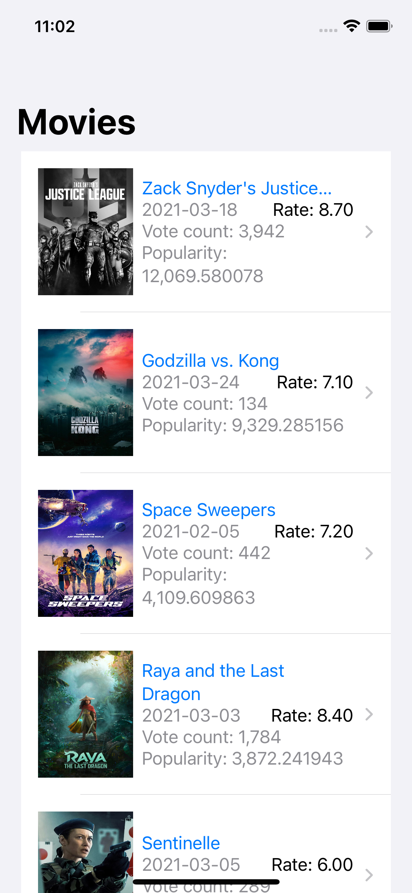

[![Contributors][contributors-shield]][contributors-url]
[![Forks][forks-shield]][forks-url]
[![Stargazers][stars-shield]][stars-url]
[![Issues][issues-shield]][issues-url]

<br />
<p align="center">
  <a href="https://github.com/ajvelo/Movie-Selector">
  
  </a>

  <h3 align="center">Movie Selector</h3>

  <p align="center">
  An application where you can find movies using The Movie Database API
    <br />
    <a href="https://github.com/ajvelo/Movie-Selector"><strong>Explore the docs »</strong></a>
    <br />
    <br />
    <a href="https://github.com/ajvelo/Movie-Selector">View Demo</a>
    ·
    <a href="https://github.com/ajvelo/Movie-Selector/issues">Report Bug</a>
    ·
    <a href="https://github.com/ajvelo/Movie-Selector/issues">Request Feature</a>
  </p>
</p>


<!-- TABLE OF CONTENTS -->
<details open="open">
  <summary><h2 style="display: inline-block">Table of Contents</h2></summary>
  <ol>
    <li>
      <a href="#about-the-project">About The Project</a>
      <ul>
        <li><a href="#built-with">Built With</a></li>
      </ul>
    </li>
    <li>
      <a href="#getting-started">Getting Started</a>
      <ul>
        <li><a href="#prerequisites">Prerequisites</a></li>
        <li><a href="#installation">Installation</a></li>
      </ul>
    </li>
  </ol>
</details>


<!-- ABOUT THE PROJECT -->
## About The Project

An iOS application where you can find movies using The Movie Database API


### Built With

This project is built with Xcode 12.4.


<!-- GETTING STARTED -->
## Getting Started

To get a local copy up and running follow these simple steps.

### Prerequisites

### Installation

1. Clone the repo
   ```sh
   git clone https://github.com/ajvelo/Movie-Selector.git
   ```
2. Sign up for a developer account at https://developers.themoviedb.org/ to get your API key
3. Within the project, create a Constants.swift file:
   ```
   struct Constants {
    static let API_KEY = "<YOUR-API-KEY>"
    static let BASE_URL = "https://api.themoviedb.org/3/"
    static let FETCH_POPULAR_MOVIES_PATH = "discover/movie?sort_by=popularity.desc"
    static let BASE_IMAGE_URL = "https://image.tmdb.org/t/p/original/"
    }
    ```
5. Run the project!

## Usage

<p align="center">

&nbsp; &nbsp; &nbsp; &nbsp;

</p>


<!-- ROADMAP -->
## Roadmap

See the [open issues](https://github.com/ajvelo/Movie-Selector/issues) for a list of proposed features (and known issues).


<!-- CONTRIBUTING -->
## Contributing

Contributions are what make the open source community such an amazing place to be learn, inspire, and create. Any contributions you make are **greatly appreciated**.

1. Fork the Project
2. Create your Feature Branch (`git checkout -b feature/AmazingFeature`)
3. Commit your Changes (`git commit -m 'Add some AmazingFeature'`)
4. Push to the Branch (`git push origin feature/AmazingFeature`)
5. Open a Pull Request


[contributors-shield]: https://img.shields.io/github/contributors/ajvelo/Movie-Selector.svg?style=for-the-badge
[contributors-url]: https://github.com/ajvelo/Movie-Selector/graphs/contributors
[forks-shield]: https://img.shields.io/github/forks/ajvelo/Movie-Selector.svg?style=for-the-badge
[forks-url]: https://github.com/ajvelo/Movie-Selector/network/members
[stars-shield]: https://img.shields.io/github/stars/ajvelo/Movie-Selector.svg?style=for-the-badge
[stars-url]: https://github.com/ajvelo/Movie-Selector/stargazers
[issues-shield]: https://img.shields.io/github/issues/ajvelo/Movie-Selector.svg?style=for-the-badge
[issues-url]: https://github.com/ajvelo/Movie-Selector/issues
